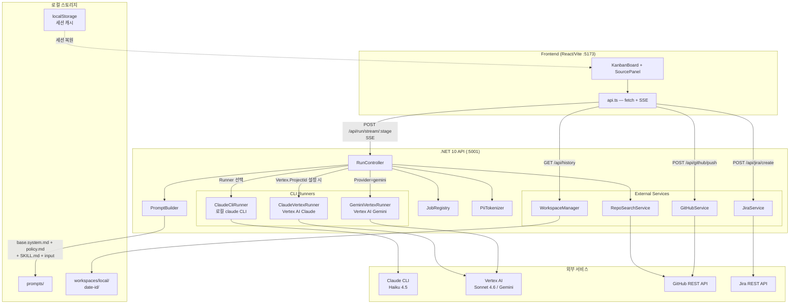
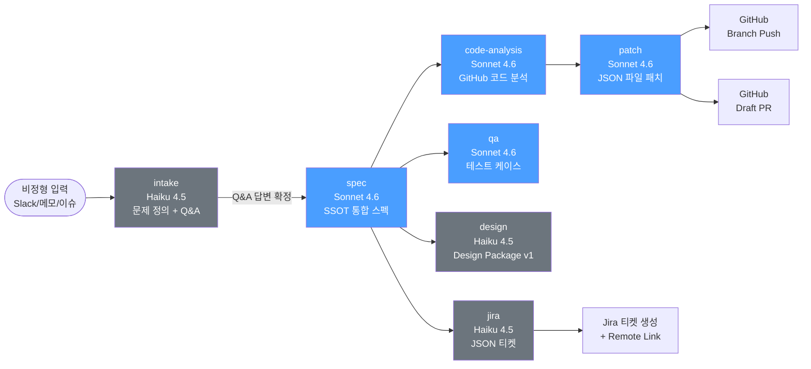
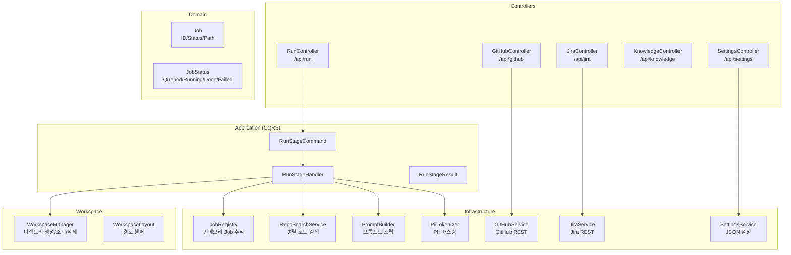
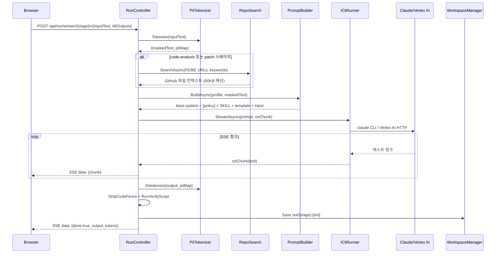
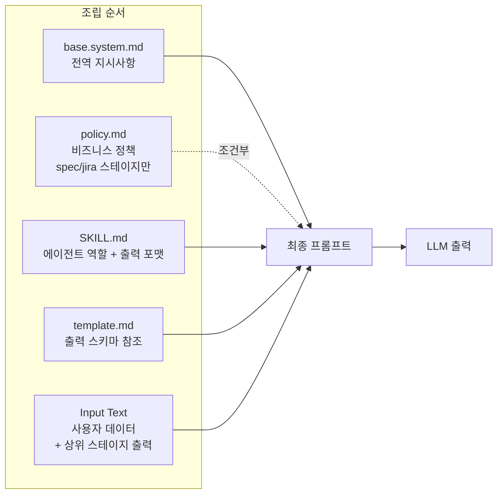
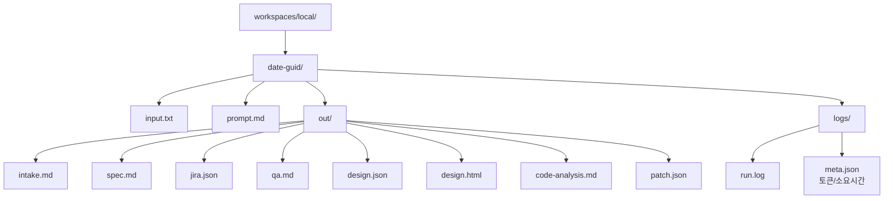
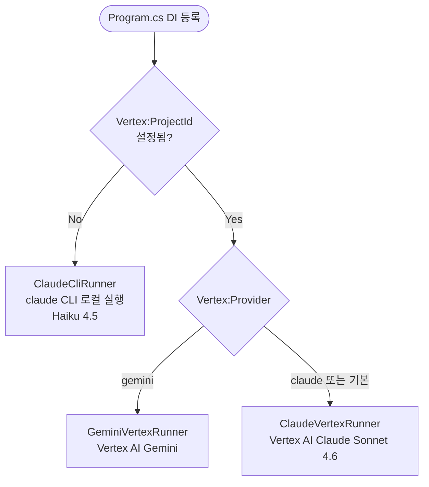

# AI Spec Pipeline — Architecture

비정형 요구사항을 intake → spec → jira/qa/design → code-analysis → patch 순서로 자동화하는 로컬 툴.

---

## 1. 전체 시스템 구조

---

## 2. 파이프라인 스테이지 흐름

---

## 3. 백엔드 레이어 구조

---

## 4. SSE 스트리밍 요청 시퀀스

---

## 5. 프롬프트 조립 구조

---

## 6. 워크스페이스 디렉토리 구조

---

## 7. Runner 선택 로직 (DI)

---

## 스테이지별 모델 / 입출력 요약

| 스테이지 | 기본 모델 | 입력 | 출력 형식 |
|---------|---------|------|---------|
| intake | Haiku 4.5 | 비정형 텍스트 | Markdown (문제 정의 + Q&A) |
| spec | Sonnet 4.6 | intake + decisions | Markdown (SSOT 스펙) |
| jira | Haiku 4.5 | spec | JSON |
| qa | Sonnet 4.6 | spec | Markdown (테스트 케이스) |
| design | Haiku 4.5 | spec | JSON (Design Package v1) |
| code-analysis | Sonnet 4.6 | spec + GitHub 코드 | Markdown |
| patch | Sonnet 4.6 | code-analysis + spec | JSON 배열 |
| policy-update | Sonnet 4.6 | policy + 새 결정사항 | Markdown |
